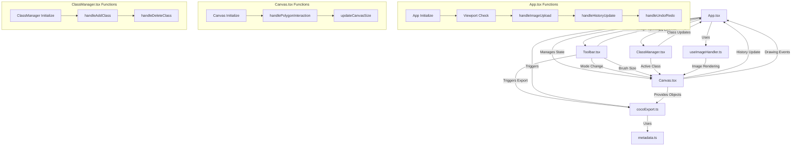

## App.tsx
Main application component that manages the overall state and layout of the application.

Functions:
- `App()` - Main component that manages state for annotation mode, brush size, classes, history, and image handling
- `useEffect (viewport check)` - Monitors viewport size to adjust layout for responsive design
- `handleAddClass()` - Manages state updates when adding a new segmentation class
- `handleDeleteClass()` - Handles the deletion of segmentation classes
- `handleSelectClass()` - Updates the currently selected class
- `handleHistoryUpdate()` - Maintains canvas state history for undo/redo functionality
- `handleUndo()` - Reverts canvas to previous state
- `handleRedo()` - Restores previously undone canvas state
- `handleImageUpload()` - Processes image file uploads and updates state

## Canvas.tsx
Handles the drawing canvas functionality using Fabric.js.

Functions:
- `Canvas()` - Main canvas component that handles drawing and interaction modes
- `handlePolygonInteraction()` - Manages polygon drawing interactions
- `useEffect (canvas initialization)` - Sets up Fabric.js canvas and drawing settings
- `updateCanvasSize()` - Adjusts canvas dimensions on window resize

## ClassManager.tsx
Manages segmentation classes and their properties.

Functions:
- `ClassManager()` - Main component for managing segmentation classes
- `resetForm()` - Resets the class creation form
- `handleAddClass()` - Processes new class creation
- `handleDeleteClass()` - Handles class deletion
- `colorPicker` - Memoized color picker component

## Toolbar.tsx
Provides tools for image manipulation and annotation.

Functions:
- `Toolbar()` - Main toolbar component with various annotation tools
- Contains buttons and controls for:
  - Image upload/export
  - Selection tools (Select, Pan, Polygon, Brush)
  - Brush size control
  - Eraser tool
  - Undo/Redo functionality
  - Zoom controls

## useImageHandler.ts
Custom hook for handling image operations.

Functions:
- `useImageHandler()` - Manages image rendering on canvas
  - Handles image loading and placement
  - Calculates appropriate scaling
  - Manages canvas state updates

## cocoExport.ts
Handles export functionality to COCO format.

Functions:
- `exportToCOCO()` - Converts canvas annotations to COCO format
  - Processes canvas objects into COCO annotations
  - Handles metadata formatting
  - Generates bounding boxes and segmentation data

## metadata.ts
Contains application metadata configuration.

Configuration:
- `appMetadata` - Object containing:
  - Project description
  - Version information
  - Licensing details
  - URL configurations
  - Date and contributor information

## Application Flow and Component Interactions

This flowchart illustrates the relationships and interactions between different components and their functions in the application. The arrows indicate data flow and function calls between components. The subgraphs show the internal function flows within major components.
